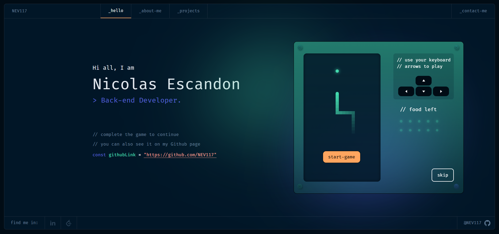

<h1 align="center">
  NEV Portfolio
</h1>

<div align="center">

[](https://app.netlify.com/sites/nev-potfolio/deploys)

</div>

<p align="center">
  <a href="" target="_blank">
    
  </a>
</p>


## 🛠 Installation

1. Clone the project to your local machine.

```sh
git clone https://github.com/NEV117/Porfoliot-v.2.git
```

2. Navigate to the project directory

```sh
cd developer-portfolio-v2
```

3. Install the required dependencies

```sh
yarn
```

4. Start the development server

```sh
yarn dev
```

5. The development server should now be running on <a href="http://localhost:3000/">http://localhost:3000/</a>


## License

This project is licensed under the MIT License. See the <a href="https://github.com/alexdeploy/developer-portfolio-v2/blob/main/LICENSE">LICENSE</a> file for more information.

## Credits 
<p align="left">
  For this proyect i used and modify a template from  <a href="https://github.com/alexdeploy">@alexdeploy</a>

  <a href="https://www.figma.com/community/file/1100794861710979147" target="_blank"> Portfolio for Developers Concept V.2</a>, designed by <a href="https://www.behance.net/darelova" target="_blank">@darelova</a> and developed by <a href="https://github.com/alexdeploy">@alexdeploy</a>. Built with <a href="https://nuxt.com/" target="_blank">Nuxt.js 3.0</a> and hosted with <a href="https://www.netlify.com/" target="_blank">Netlify</a>.
</p>